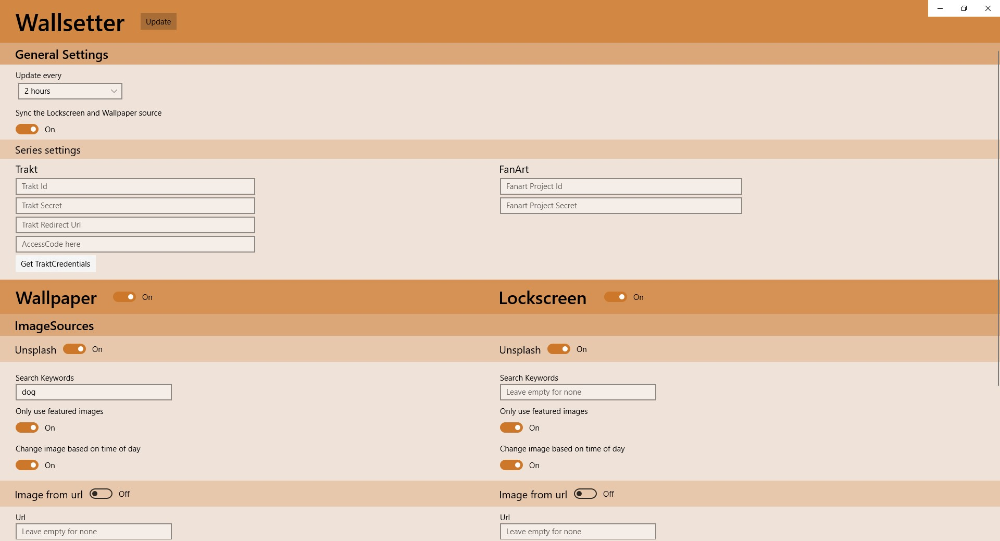

# Wallsetter

Supercharging your wallpaper. This is what Wallsetter does. Every [15 minutes - 2 days] it will update your [lockscreen or wallpaper] image to a beautiful image of a [sunset, dog or forest] and apply a [blur, black&white, sepia] effect over it.

To run this project, open it in [Visual Studio 2019](https://visualstudio.microsoft.com/vs/).